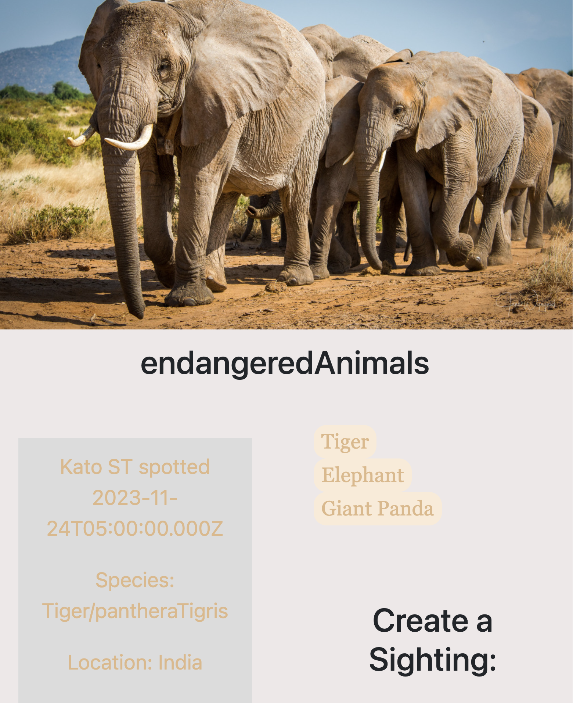

# Endangered Animals Application

### Project Description:

This Endangered Animals Application will display all animal groups for the user, all sightings of individual animals and allow the user to create news sightings of individual animals. 

### Install Project 

If you are interested in installing and running this project on your local computer, follow the steps below:

* Go to your project directory in your terminal and run the command ***git clonegit@github.com:Whitney-Rene/endangeredAnimals.git NAMENEWDIRECTORY***

* To remove the source code git out of the project directory, run the command ***rm -rf .git***

* Then while still within the project directory in your terminal, run the command ***git init*** to start your own git track

* In the terminal, go to the server directory ***cd server*** and run the command ***npm run dev***. This will start the server in both your server directory and your client directory concurrently.

* Please see the db.sql file, located in the db directory, for a list of SQL statements that you can run in your terminal to create a contacts database with one table "contacts" to get you started

### How to Use the Project

The project will look like this on the client side:

This project is used to keep track of individual animals sightings.  Please note it does not include code for deleting or editing a sighting, but this can easily be added.

### Technologies Used

* React
* JavaScript / NodeJs
* Express
* SQL
* Postgres
* Jest
* React Testing Library

### Developer Contact

Hi, I am Whitney-Rene.  I am a full stack engineer in a 6 month bootcamp called Techtonica.

You can find me on LinkedIn here: https://www.linkedin.com/in/whitney-rene-chambers/ .
